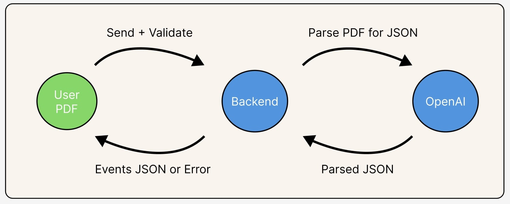
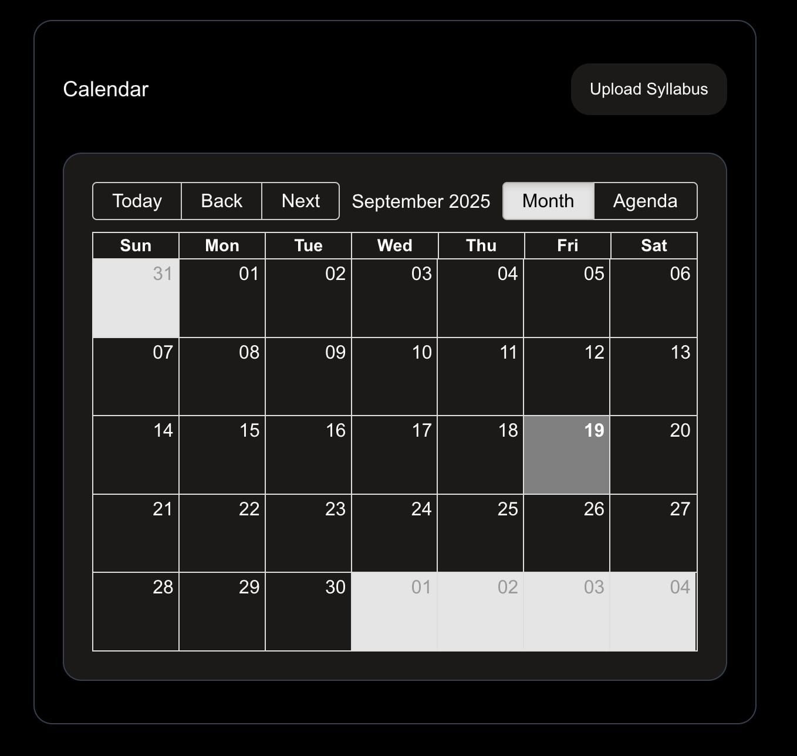

# Syllabus To Calendar

[](https://openai.com/)
[](https://nextjs.org/)
[](https://react.dev/)
[](https://vercel.com/)
[](https://jestjs.io/)
[](https://www.typescriptlang.org/)

__Why did we make this?__

As a student myself, I wanted to develop a tool that can convert and overlay multiple course events onto a single calendar which I can both see and interact with. Thus, I made this syllabus parser which can read PDFs to populate a live calendar.

Home Website: [https://syllabus-to-calendar-brown.vercel.app/](https://syllabus-to-calendar-brown.vercel.app/)

## Table of Contents

- [Built With](#built-with)
- [Features](#features)
  - [Implemented](#implemented)
  - [Diagram](#diagram)
  - [Explanation](#explanation)
  - [Demo](#demo)
  - [To Be Developed](#to-be-developed)
- [Local Reproduction](#local-reproduction)

## Built With
[](https://openai.com/)

Used OpenAI's API to parse PDFs into structured JSONs.

[](https://nextjs.org/)
[](https://react.dev/)
[](https://www.typescriptlang.org/)

Uses Typescript in the full stack framework NextJs which is built on React.

[](https://vercel.com/)

Deployed serverless using Vercel.

[](https://jestjs.io/)  


Unit tests are being written using Jest. See [PR_1](https://github.com/dadal00/syllabus-to-calendar/pull/1).

[](tailwindcss.com)
[](https://en.wikipedia.org/wiki/HTML)
[](https://en.wikipedia.org/wiki/CSS)

Additional frontend tools.

## Features

### Implemented

- Syllabus PDF parsing into calendar events
  - Visible success or error messages after processing
    - _Currently, on successful parse, users have to manually shift the calendar view from today's display to the corresponding event parsed. So if today was 9/19/25 but the first event was on 7/19/24. The calendar would still show 9/25, which forces the user to manually shift the month view to 7/24._
  - Loading animation when processing
  - Server side validation for max file size and mime extension
- List view under 'Agenda'
- Interactable calendar view under 'Month'
  - Marks current day
  - Navigatable calendar using 'Today', 'Back', and 'Next'

### Diagram



### Explanation

First, we receive the syllabus PDF on the frontend. We then send this file to our backend.

At this point, we first check to see the type and the size of the file we are receiving. This is to prevent security vulnerabilities on the server side. If any of these checks fail, we give back an error response which is displayed to the user.

Othewise, we move the file along and send it to OpenAI to parse it. We specify a specific JSON format for OpenAI to respond with and safely verify the format of that output. If the result does not match our specified format, we send back an internal error to the user.

Assuming the format is valid, we convert it into an array of event objects, or a format compatible for the frontend to parse. The frontend receives this format and populates the calendar with said events.

### Demo



### To Be Developed

_Each feature will have a title and a brief explanation as to how to implement it._

Revertable Events

- Mark new events with a prefix.
- Give user choice as to whether or not to revert the calendar before file parsing.
- If remove, remove all events with prefix.
- If keep, remove prefix.

Google Calendar Integration

- Check if the user has google authenticated cookie.
- If so, provide user the option to sync with calendar.
- If user syncs with calendar, after obtaining array of events.
  - Send these events to google calendar API.
- When sending array of events, append the success or error of the calendar API.

Client Side Validation

- Check if file size and file extension is expected

Instant View Change

- The moment we successfully receive the events array. We will shift the calendar view to the first event that was received.
  - This provides an easy feedback loop to the user to instantly notice the parsed events.

## Local Reproduction

1. ```bash
   echo OPENAI_API_KEY=YOUR_KEY > .env
   ```

2. ```bash
   npm install
   ```

3. ```bash
   npm run dev
   ```

4. Go to [http://localhost:3000/](http://localhost:3000/)
